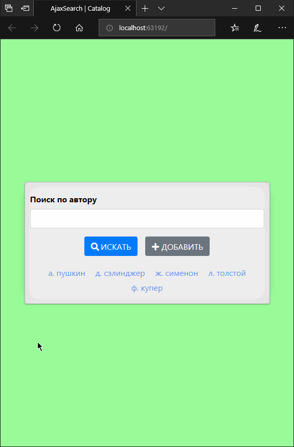

# jQuery **Ajax-запросы**, **Ajax-формы**

________________________________________________________________

#### Задача реализовать поиск по БД информации о всех книгах определённого автора с выполнением загрузки данных в асинхронном режиме:

 - Разработать действующий пример веб-приложения

 - Получить результаты поиска асинхронно с ***Ajax*** (без перезагрузки всей страницы)

 - Интегрировать базовые функции ***CRUD*** для работы с БД

________________________________________________________________

#### Решение создано на платформе *```ASP.NET Core```* с применением паттерна *```MVC```* и модуля объектно-реляционного представления *```EF Core```*.

**Ассистирующая группа технологий:**  
> ```C#```, ```ASP.NET Razor```, ```LINQ```, ```MS SQL Server LocalDB```,  
> ```JavaScript```, ```jQuery```, ```Ajax```


**Демонстрация:**



--
*Веб-приложение "AjaxSearch", подготовил Александр Усов*
